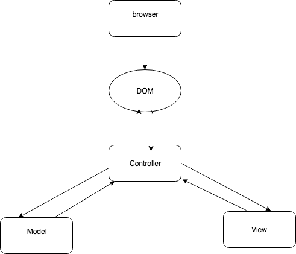

1. On page load a controller is instantiated with an event listener function
2. An event triggers a function to be called in the controller, in this case the event  is when a user clicks on a button.
3. The controller takes in the values inputted from the user and calls a function at the model level
4. The model responds with a result of the calculation
5. The result is then processed in the view file
6. The view file can then use the DOM to dynamically manipulated the HTML files(document object) using DOM methods like innerHTML, getElementByID

